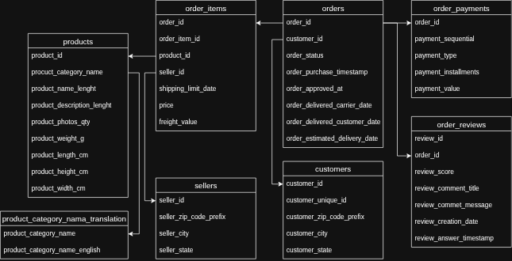
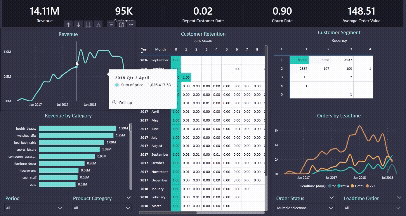

# 📊 E-Commerce Customer & Revenue Analytics
### End-to-End SQL + Python + BI Project  

## 1. Executive Summary  
This project analyzes transactional e-commerce data to identify revenue drivers, customer retention patterns, and product performance insights. 

The objective was to simulate a real-world business scenario where leadership needs actionable insights to increase revenue and improve customer lifetime value. 

Key outcomes:
- Identified that top customer segment drives majority of revenue
- Quantified repeat purchase contribution
- Discovered retention drop-off after first purchase
- Proposed retention-focused strategy to improve long-term revenue

## 2. Problem Statement
The leadership team observed revenue volatility and declining repeat purchase behavior.

Key business questions:
1. What drives monthly revenue fluctuations?
2. Who are our highest-value customers?
3. What factors influence repeat purchases?
4. Where does customer retention drop?

Success Criteria:
- Quantify revenue distribution
- Segment customers meaningfully
- Provide measurable recommendations

## 3. Dataset & Data Model
Dataset: Brazilian E-Commerce Public Dataset (Kaggle).

Data includes:
- Orders
- Order Items
- Customers
- Products
- Payments

Data was loaded into PostgreSQL and modeled using a relational schema.

Core relationships:
- One-to-many: orders → order_items
- One-to-one: orders → payments
- Many-to-one: order_items → products  



Data validation steps:
- Checked null values
- Verified foreign key consistency
- Removed cancelled transactions
- Standardized date formats

## 4. Methodology
### Step 1 — SQL-Based Aggregation
Used SQL for scalable analysis:
- Revenue calculation using SUM(quantity * price)
- Window functions for customer ranking
- Cohort grouping via first_purchase_month
- RFM segmentation using percentile scoring

### Step 2 — Customer Segmentation (RFM)
Customers segmented using:
- Recency (days since last purchase)
- Frequency (total orders)
- Monetary (total spend)

Segment definitions:
- VIP
- Loyal
- At Risk
- Lost
- New Customer

Purpose:  
Enable targeted retention and loyalty strategies.

### Step 3 — Cohort Retention Analysis
Grouped users by acquisition month. 

Measured:
- Month 1 retention
- Month 2 retention
- Revenue per cohort

Identified retention decay pattern after first purchase month.

### Step 4 — Dashboard Design
Built executive dashboard including:
- Revenue KPI
- Growth %
- Repeat rate
- Customer segment contribution
- Product performance  



Designed for:
- C-level quick overview
- Drill-down capability
- Clear KPI storytelling

## 5. Key Insights
- 42% revenue generated by 10% custommers.
- Repeat customers generate 1.9x more revenue than one-time customers.
- Retention drops by more than 97% on Month 1.
- 10 product categories contribute 62% of revenue.
- 85% transaction with estimated delivery timeline 15+ days.

## 6. Business Impact Simulation
If repeat purchase rate increases by 5%:  
→ Projected revenue uplift of 9.5%  
→ Increased customer lifetime value  
→ Reduced dependency on new customer acquisition  

Primary Recommendation:  
__Focus on retention strategy (i.e. shorten delivery timeline) rather than acquisition-heavy growth.__

## 7. Trade-offs & Limitations
- No marketing campaign data available
- No customer demographic enrichment
- Assumed cancelled orders removed from revenue
- Limited behavioral tracking beyond transactions

Future improvements: 
- Integrate marketing funnel data
- Add churn prediction model
- Perform A/B testing on retention offers

## 8. Technical Stack
- SQL (PostgreSQL)
- Python (Pandas, Matplotlib)
- Power BI / Tableau
- Git & GitHub

## 9. Project Structure
```
ecommerce-analytics/  
│  
├── sql/  
│   ├── revenue_analysis.sql    
│   ├── customer_analysis.sql  
│   ├── rfm_segmentation.sql  
│   ├── cohort_analysis.sql  
│   └── product_analysis.sql  
│  
├── notebooks/  
│   └── ecommerce_analysis.ipynb  
│  
├── dashboard/  
│   └── brazil_ecommerce.pbix  
│  
└── README.md  
```
## 10. What This Project Demonstrates
- Strong SQL fundamentals (JOINs, CTEs, window functions)
- Data validation and cleaning workflow
- Business-oriented thinking
- Customer segmentation strategy
- Retention & revenue analysis
- Executive-level communication
